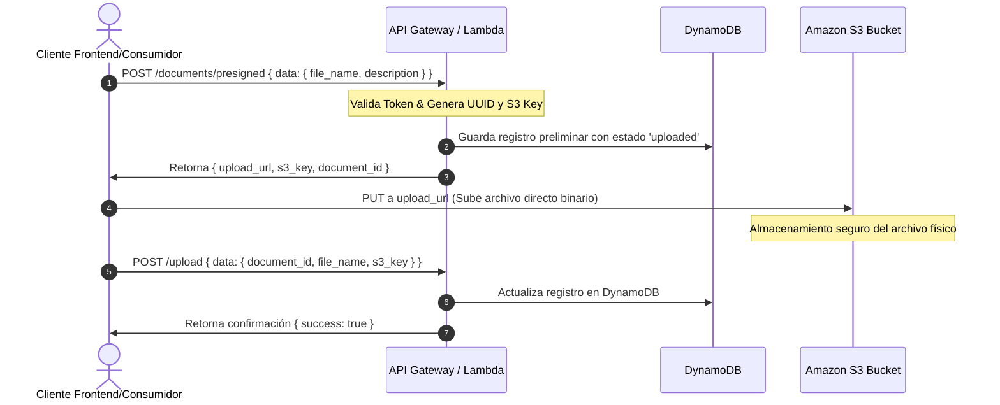
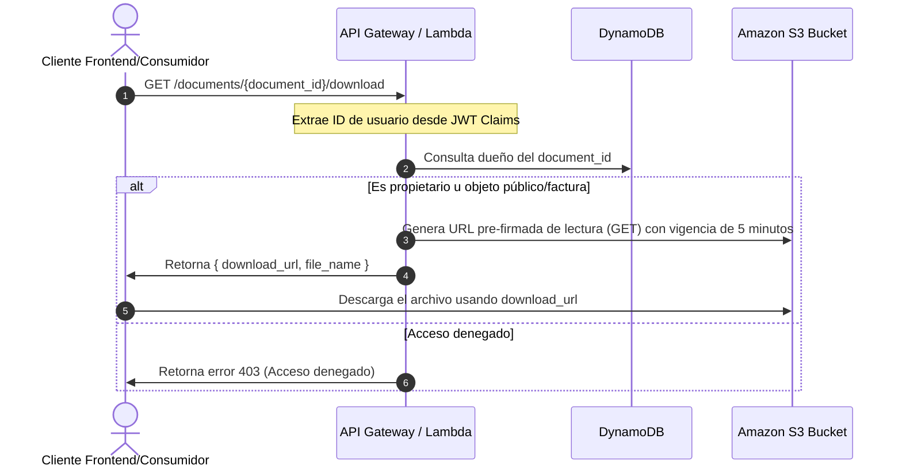
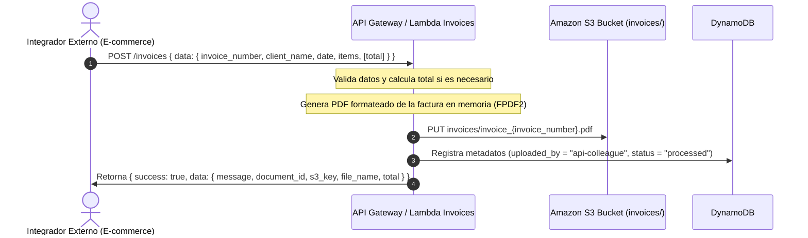

# Documentación de Arquitectura de API y Flujos de Negocio

Esta documentación describe la especificación técnica de los endpoints, las políticas de seguridad (flujo OAuth 2.0 / Client Credentials con Amazon Cognito), los estándares de intercambio de información y la regla de oro de **Cero Bloqueos**.

---

## 1. Estándar de Mensajería JSON (Request/Response)

Para asegurar la consistencia y facilidad de integración con los otros sistemas y equipos, se implementó un estándar rígido de mensajería:

### 1.1 Estructura de Petición (Request Body)
Todas las llamadas tipo `POST` o `PUT` que envíen un cuerpo JSON deben encapsular sus propiedades dentro del objeto de primer nivel `"data"`:

```json
{
  "data": {
    "campo_1": "valor",
    "campo_2": "valor"
  }
}
```

### 1.2 Estructura de Respuesta Exitosa (Success Response)
Las respuestas exitosas (`2xx`) siempre retornan un envoltorio común con las claves `success`, `code` y `data`:

```json
{
  "success": true,
  "code": 200,
  "data": {
    "mensaje": "Operación realizada con éxito",
    "detalles": {}
  }
}
```

### 1.3 Estructura de Respuesta de Error (Error Response)
Las respuestas fallidas (`4xx` o `5xx`) siguen el mismo envoltorio común, donde la clave `"data"` contiene un objeto con la propiedad `"error"` detallando el fallo:

```json
{
  "success": false,
  "code": 400,
  "data": {
    "error": "El parámetro obligatorio 'file_name' no fue proporcionado."
  }
}
```

---

## 2. Seguridad y Autenticación (Amazon Cognito OAuth 2.0)

La seguridad cumple con estándares estrictos tipo pasarela bancaria. La comunicación entre microservicios se valida mediante **Amazon Cognito** a través del flujo de **Client Credentials (OAuth 2.0)**.

### 2.1 Obtención del Token de Acceso
Cada servicio cliente debe autenticarse contra el endpoint de Cognito utilizando su `client_id` y `client_secret` asignados:

*   **Endpoint de Cognito (Token URL)**: `https://gd-jsp-v6-auth.auth.us-west-2.amazoncognito.com/oauth2/token`
*   **Método HTTP**: `POST`
*   **Headers**:
    *   `Content-Type: application/x-www-form-urlencoded`
*   **Cuerpo (URL Encoded)**:
    ```
    grant_type=client_credentials
    &client_id=1u5tlcvmaegt93ajfebjndn2g7
    &client_secret=1298pg7ue9nd77k8e6votv6tmukrd01jn09rkc0q49haanr7vd00
    &scope=https://api.document-system.com/invoices:create
    ```

#### Ejemplo de Petición con cURL
```bash
curl -X POST https://gd-jsp-v6-auth.auth.us-west-2.amazoncognito.com/oauth2/token \
  -H "Content-Type: application/x-www-form-urlencoded" \
  -d "grant_type=client_credentials&client_id=1u5tlcvmaegt93ajfebjndn2g7&client_secret=1298pg7ue9nd77k8e6votv6tmukrd01jn09rkc0q49haanr7vd00&scope=https://api.document-system.com/invoices:create"
```

#### Respuesta de Cognito (Token de Acceso)
```json
{
  "access_token": "eyJraWQiOi...",
  "expires_in": 3600,
  "token_type": "Bearer"
}
```

### 2.2 Consumo de Servicios Protegidos
Para consumir cualquier endpoint del API Gateway, se debe proveer el Token obtenido en la cabecera `Authorization`:

```http
Authorization: Bearer <access_token>
```

---

## 3. Regla de Oro: Cero Bloqueos (Feature Flags & Mock Data)

Para evitar bloquear el avance de los equipos consumidores, todos los endpoints tienen integrado un mecanismo de **Feature Flags** para entregar datos simulados (Mock Data).

### 3.1 Cómo Activar el Retorno de Datos Simulados (Mock)
Usted puede forzar que cualquier endpoint retorne datos de prueba sin necesidad de ejecutar lógica de base de datos o almacenamiento mediante **cualquiera** de estas opciones:

1.  **Header**: Incluir la cabecera `x-mock-data: true` en la petición.
2.  **Query Parameter**: Añadir `?mock=true` en la URL de la llamada.
3.  **Variable de Entorno (Servidor)**: Configurar `MOCK_DATA=true` en el entorno de la función Lambda (para mocks globales permanentes).

---

## 4. Flujos de Negocio

### 4.1 Flujo de Carga de Documentos (Subida Directa a S3)
El flujo óptimo para la carga de archivos grandes sin saturar la red del API Gateway se realiza mediante URLs pre-firmadas:



### 4.2 Flujo de Descarga de Documentos
Para descargar archivos de manera segura garantizando que solo el propietario tenga acceso:



### 4.3 Flujo de Generación de Facturas (Integración Externa)
Permite a sistemas integradores de otros equipos (como e-commerce) generar facturas en PDF enviando la información estructurada en JSON:



