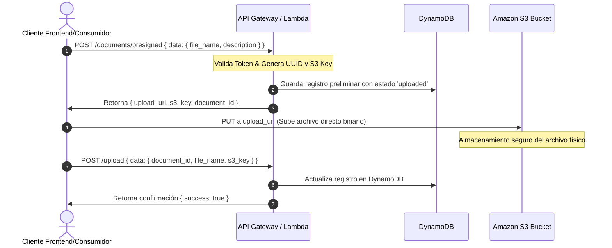
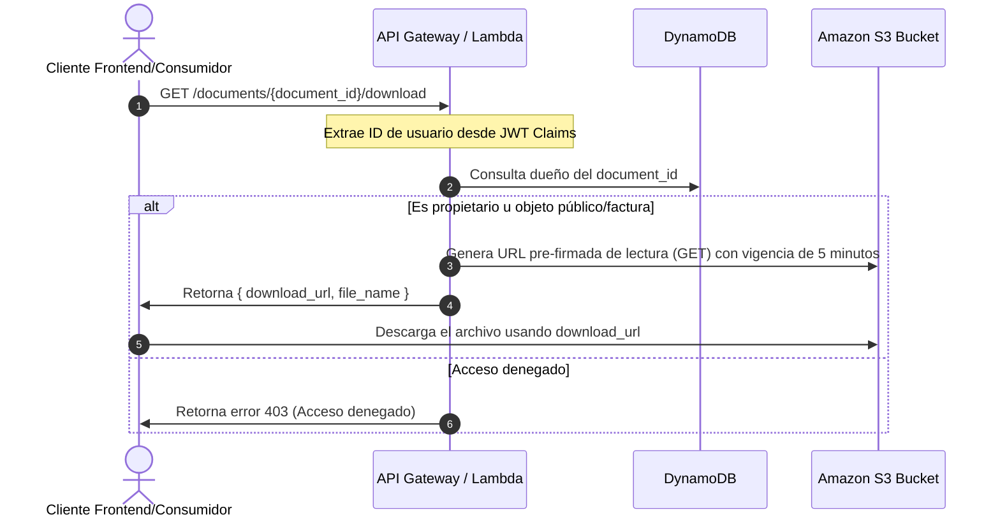
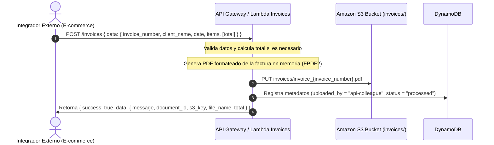

# Documentación de Arquitectura de API y Flujos de Negocio

Esta documentación describe la especificación técnica de los endpoints, las políticas de seguridad (flujo OAuth 2.0 / Client Credentials con Amazon Cognito), los estándares de intercambio de información y la regla de oro de **Cero Bloqueos**.

---

## 1. Estándar de Mensajería JSON (Request/Response)

Para asegurar la consistencia y facilidad de integración con los otros sistemas y equipos, se implementó un estándar rígido de mensajería:

### 1.1 Estructura de Petición (Request Body)
Todas las llamadas tipo `POST` o `PUT` que envíen un cuerpo JSON deben encapsular sus propiedades dentro del objeto de primer nivel `"data"`:

```json
{
  "data": {
    "campo_1": "valor",
    "campo_2": "valor"
  }
}
```

### 1.2 Estructura de Respuesta Exitosa (Success Response)
Las respuestas exitosas (`2xx`) siempre retornan un envoltorio común con las claves `success`, `code` y `data`:

```json
{
  "success": true,
  "code": 200,
  "data": {
    "mensaje": "Operación realizada con éxito",
    "detalles": {}
  }
}
```

### 1.3 Estructura de Respuesta de Error (Error Response)
Las respuestas fallidas (`4xx` o `5xx`) siguen el mismo envoltorio común, donde la clave `"data"` contiene un objeto con la propiedad `"error"` detallando el fallo:

```json
{
  "success": false,
  "code": 400,
  "data": {
    "error": "El parámetro obligatorio 'file_name' no fue proporcionado."
  }
}
```

---

## 2. Seguridad y Autenticación (Amazon Cognito OAuth 2.0)

La seguridad cumple con estándares estrictos tipo pasarela bancaria. La comunicación entre microservicios se valida mediante **Amazon Cognito** a través del flujo de **Client Credentials (OAuth 2.0)**.

### 2.1 Obtención del Token de Acceso
Cada servicio cliente debe autenticarse contra el endpoint de Cognito utilizando su `client_id` y `client_secret` asignados:

*   **Endpoint de Cognito (Token URL)**: `https://gd-jsp-v6-auth.auth.us-west-2.amazoncognito.com/oauth2/token`
*   **Método HTTP**: `POST`
*   **Headers**:
    *   `Content-Type: application/x-www-form-urlencoded`
*   **Cuerpo (URL Encoded)**:
    ```
    grant_type=client_credentials
    &client_id=1u5tlcvmaegt93ajfebjndn2g7
    &client_secret=1298pg7ue9nd77k8e6votv6tmukrd01jn09rkc0q49haanr7vd00
    &scope=https://api.document-system.com/invoices:create
    ```

#### Ejemplo de Petición con cURL
```bash
curl -X POST https://gd-jsp-v6-auth.auth.us-west-2.amazoncognito.com/oauth2/token \
  -H "Content-Type: application/x-www-form-urlencoded" \
  -d "grant_type=client_credentials&client_id=1u5tlcvmaegt93ajfebjndn2g7&client_secret=1298pg7ue9nd77k8e6votv6tmukrd01jn09rkc0q49haanr7vd00&scope=https://api.document-system.com/invoices:create"
```

#### Respuesta de Cognito (Token de Acceso)
```json
{
  "access_token": "eyJraWQiOi...",
  "expires_in": 3600,
  "token_type": "Bearer"
}
```

### 2.2 Consumo de Servicios Protegidos
Para consumir cualquier endpoint del API Gateway, se debe proveer el Token obtenido en la cabecera `Authorization`:

```http
Authorization: Bearer <access_token>
```

---

## 3. Regla de Oro: Cero Bloqueos (Feature Flags & Mock Data)

Para evitar bloquear el avance de los equipos consumidores, todos los endpoints tienen integrado un mecanismo de **Feature Flags** para entregar datos simulados (Mock Data).

### 3.1 Cómo Activar el Retorno de Datos Simulados (Mock)
Usted puede forzar que cualquier endpoint retorne datos de prueba sin necesidad de ejecutar lógica de base de datos o almacenamiento mediante **cualquiera** de estas opciones:

1.  **Header**: Incluir la cabecera `x-mock-data: true` en la petición.
2.  **Query Parameter**: Añadir `?mock=true` en la URL de la llamada.
3.  **Variable de Entorno (Servidor)**: Configurar `MOCK_DATA=true` en el entorno de la función Lambda (para mocks globales permanentes).

---

## 4. Flujos de Negocio

### 4.1 Flujo de Carga de Documentos (Subida Directa a S3)
El flujo óptimo para la carga de archivos grandes sin saturar la red del API Gateway se realiza mediante URLs pre-firmadas:



### 4.2 Flujo de Descarga de Documentos
Para descargar archivos de manera segura garantizando que solo el propietario tenga acceso:



### 4.3 Flujo de Generación de Facturas (Integración Externa)
Permite a sistemas integradores de otros equipos (como e-commerce) generar facturas en PDF enviando la información estructurada en JSON:



---

## 5. Defensa Técnica de la Arquitectura (¿Por qué? y ¿Para qué?)

En esta sección se justifica el diseño de la arquitectura y la selección de cada componente tecnológico frente a posibles evaluaciones o auditorías técnicas:

### 5.1 Arquitectura 100% Serverless (AWS Lambda, API Gateway, Cognito)
*   **¿Por qué? (Problema):** Los servidores tradicionales en la nube (como máquinas virtuales EC2 de AWS o servidores físicos en data centers) generan un gasto fijo mensual continuo, incluso cuando el sistema no recibe uso (por ejemplo, en horarios nocturnos o fines de semana). Además, requieren que el equipo técnico dedique horas de trabajo a instalar actualizaciones del sistema operativo, parches de seguridad y configurar el balanceo de carga.
*   **¿Para qué? (Solución):** Para **reducir los costos operativos a cero** en momentos de inactividad y garantizar escalabilidad automática e infinita. Si entran miles de peticiones al mismo tiempo, AWS duplica los recursos de ejecución en milisegundos y los destruye al terminar. Solo se factura el tiempo exacto de procesamiento en milisegundos.

### 5.2 AWS Lambda Layer (Capa Compartida de Lambdas)
*   **¿Por qué? (Problema):** Si cada una de las 8 funciones de backend tuviera que incluir físicamente en su propio archivo de código las librerías compartidas (como `sentry-sdk` para excepciones, `fpdf2` para generar PDF o `pillow` para imágenes), los archivos de despliegue pesarían megabytes adicionales, ralentizando los despliegues de CI/CD y aumentando el tiempo de arranque en frío (Cold Start) de las Lambdas.
*   **¿Para qué? (Solución):** Para **centralizar, reutilizar y estandarizar las dependencias**. El código fuente de las Lambdas permanece liviano (menos de 5 KB), lo que permite que se carguen de forma casi instantánea en AWS, garantizando además que todas las Lambdas utilicen exactamente la misma versión de las librerías.

### 5.3 Procesamiento Asíncrono (SQS + Async Processor)
*   **¿Por qué? (Problema):** El procesamiento, lectura de metadatos o análisis de un archivo pesado puede tomar varios segundos. Si realizáramos esta lógica pesada de forma síncrona dentro de la petición web, la experiencia del usuario final sería pésima al ver su pantalla "congelada", y el API Gateway podría dar un error de tiempo límite superado (timeout de 30 segundos), cancelando la operación a mitad de camino.
*   **¿Para qué? (Solución):** Para **desacoplar los componentes del sistema**. Cuando el usuario sube un archivo, recibe una confirmación inmediata en milisegundos de que el archivo fue "recibido", y el trabajo pesado se delega de forma asíncrona en segundo plano a la cola **SQS**, la cual entrega las tareas a la Lambda de procesamiento al ritmo que el sistema sea capaz de digerirlas sin saturarse.

### 5.4 Dead Letter Queue (DLQ - Cola de Errores)
*   **¿Por qué? (Problema):** Si un archivo subido está corrupto o tiene un formato no soportado, la Lambda de procesamiento fallará en repetidos intentos. Si no tuviéramos un mecanismo de aislamiento, el archivo defectuoso se quedaría intentando procesarse indefinidamente, bloqueando y retrasando el procesamiento de los archivos sanos de los demás usuarios en la cola de SQS.
*   **¿Para qué? (Solución):** Como **mecanismo de tolerancia a fallos**. Si un mensaje de procesamiento falla 3 veces consecutivas, SQS lo mueve de forma automática a la DLQ. El flujo de procesamiento principal sigue operando sin interrupción, y el equipo técnico de soporte puede inspeccionar la DLQ de forma aislada para auditar y reparar el problema del archivo dañado.

### 5.5 Amazon S3 Pre-signed URLs (URLs Pre-firmadas)
*   **¿Por qué? (Problema):** Si el Frontend web tuviera que enviar los bytes del archivo PDF a través de nuestra API Gateway y nuestras funciones Lambda para guardarlos en S3, la transferencia de datos en el Gateway generaría altos costos financieros y la Lambda consumiría toda su memoria RAM intentando almacenar temporalmente el archivo antes de escribirlo en S3.
*   **¿Para qué? (Solución):** Para **optimizar el ancho de banda y el consumo de recursos**. El navegador web del usuario solicita una URL pre-firmada segura y sube el archivo de forma directa al almacenamiento físico de Amazon S3, liberando por completo la carga de red de nuestra API interna.

### 5.6 Cifrado SSE-KMS en S3 + SigV4
*   **¿Por qué? (Problema):** Guardar documentos confidenciales de la compañía o facturas expuestas en la nube en texto plano es un grave riesgo de seguridad que viola las normativas de protección de datos personales y comerciales.
*   **¿Para qué? (Solución):** Para **garantizar seguridad estricta y cumplimiento normativo corporativo**. Todo archivo subido a S3 se encripta de forma transparente del lado del servidor usando llaves criptográficas administradas por **AWS KMS**. Para la lectura o visualización, el sistema exige que las URLs temporales de descarga se firmen usando el estándar **AWS Signature Version 4 (SigV4)**, descifrando el archivo en vivo únicamente para usuarios debidamente autorizados.

---

## 6. Glosario de Conceptos de Nube para Principiantes

*   **Región de AWS:** Zona geográfica del mundo físico donde Amazon tiene sus centros de datos (por ejemplo, `us-west-2` en Oregón).
*   **IAM (Identity and Access Management):** El sistema de AWS encargado de gestionar usuarios, grupos, roles y políticas de seguridad. Controla qué componente de la nube tiene permiso de acceder a qué recurso (regla del mínimo privilegio).
*   **NoSQL (DynamoDB):** Base de datos optimizada para ofrecer respuestas en milisegundos a cualquier nivel de escala, sin requerir una estructura rígida de tablas de Excel relacionales.
*   **OAuth 2.0 / Client Credentials:** Estándar de la industria que permite la comunicación e integración segura entre sistemas o servidores (máquina a máquina) sin necesidad de interactuar con una interfaz visual de usuario ni utilizar contraseñas humanas.
*   **Mock Data:** Datos simulados predecibles que se usan para pruebas locales o de integración rápida para evitar que un equipo se quede de brazos cruzados esperando a que el otro termine de construir su base de datos.
*   **Sentry SDK:** Herramienta de telemetría y monitoreo de excepciones en vivo que genera alertas automáticas detallando errores de código y la línea exacta del fallo en producción.

---

## 7. Especificación Técnica de los Recursos Activos en AWS (us-west-2 Oregón)

Para realizar pruebas directas o consumir la infraestructura desplegada, utilice los siguientes datos de configuración oficiales:

### 7.1 Autenticación de Máquina a Máquina (Cognito Client Credentials)
*   **Token URL:** `https://gd-jsp-v6-auth.auth.us-west-2.amazoncognito.com/oauth2/token`
*   **Credenciales de Integración (Dev/Prod):**
    *   **Client ID:** `1u5tlcvmaegt93ajfebjndn2g7`
    *   **Client Secret:** `1298pg7ue9nd77k8e6votv6tmukrd01jn09rkc0q49haanr7vd00`
*   **Scope Requerido:** `https://api.document-system.com/invoices:create` (para facturas) o `https://api.document-system.com/documents:read` (para listados).

### 7.2 Endpoint Base de la API Gateway (REST API ID: spljt9ppl5)
*   **API Gateway Base URL:** `https://spljt9ppl5.execute-api.us-west-2.amazonaws.com/dev`
*   **Ruta de Facturas:** `POST https://spljt9ppl5.execute-api.us-west-2.amazonaws.com/dev/invoices`
*   **Ruta de Documentos:** `GET https://spljt9ppl5.execute-api.us-west-2.amazonaws.com/dev/documents`

### 7.3 Recursos Físicos de AWS
*   **Amazon DynamoDB Table:** `document-system-dev-documents`
*   **Amazon S3 Bucket:** `document-system-dev-documents` (con prefijos `documents/` e `invoices/`)
*   **Amazon SQS Queue:** `document-system-dev-queue`
*   **Amazon SQS DLQ:** `document-system-dev-dlq`
